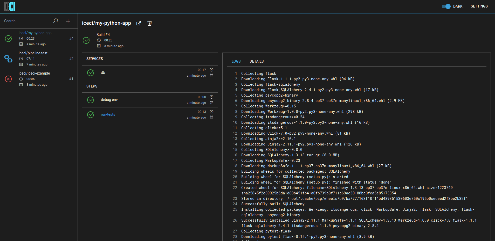

# IceCI - chill out and integrate.
## About
IceCI is a continuous integration system designed for Kubernetes from the ground up.  

## Status

This project is currently in early alpha stage and we're eager to hear your feedback. If you have any suggestions - please drop us a line at iceci@icetek.io.

For more information visit [iceci.io](https://iceci.io/) or check out the [docs](https://docs.iceci.io/).

## FAQ

_Q: Where can I find the source code?_

A: The project is in early alpha and is undergoing constant changes. We're still working on building a vision for the product - we're planning on opensourcing all (or most) of it once it's stabilized.

_Q: Will IceCI remain free?_

A: None of the currently available functionalities will become paid ones. We are considering introducing enterprise plugins (like LDAP integration, for example) sometime in the future, however the core of IceCI will _always_ remain free. 

---

_Kept cool &#x1f9ca; by [Icetek](https://icetek.io/)_
