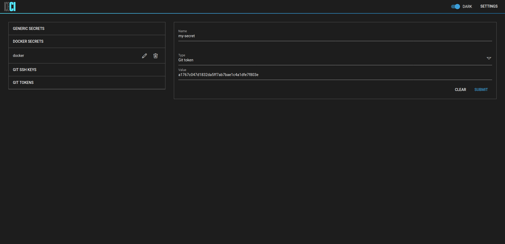
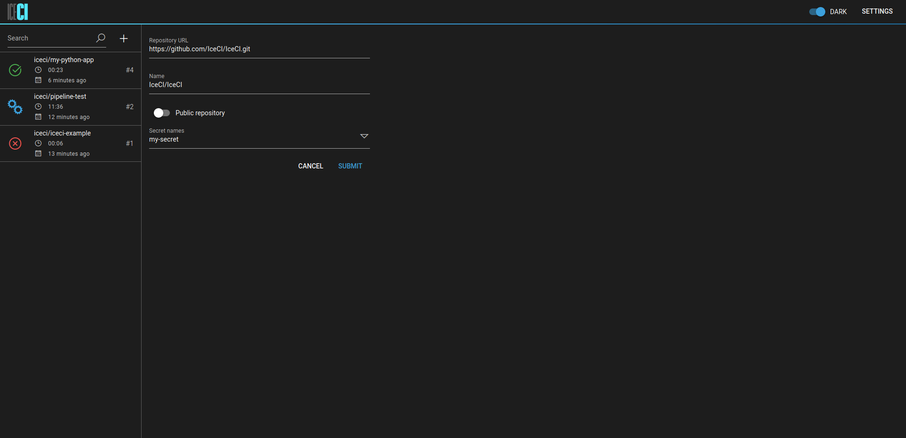

# IceCI - chill out and integrate.
  
IceCI is a continuous integration system designed for Kubernetes from the ground up.  


## Running IceCI locally
### Preparing the cluster

To run IceCI, you need a working local Kubernetes cluster - you can use [Minikube](https://minikube.sigs.k8s.io/) or [K3s](https://k3s.io/). Follow the installation instructions of the cluster of your choice.

### Prepare the cluster

Create an `iceci` namespace and update your `kubectl` config to use it. This will be the namespace that IceCI will be operating and creating all its objects in. This step is recommended, although it's not required.

```shell script
kubectl create ns iceci
kubectl config set-context --current --namespace=iceci
``` 

### Deploy the applications
Deploy the required custom resources and the IceCI operator itself. This is the minimum setup required to be able to run and monitor workloads using `kubectl`.

```shell script
kubectl apply -f manifests/crds
kubectl apply -f manifests/operator
```

An additional set of independently deployed applications allows for persisting data and configuring the workloads using a web-based UI. Those applications include the API, UI, Sync as well as a PostgreSQL database and can be deployed by applying an additional set of Kubernetes manifests.

```shell script
kubectl apply -f manifests/app
``` 

Note - the setup assumes the ingress controller is running on your Kubernetes host. It creates an ingress rule without a *host* routing. You can change this in the *ingress* configuration.

## Using IceCI
### Secret management
Using private Git repositories and Docker registries requires creating secrets. You can create secrets in the _Settings_ section of the UI. A proper secret type must be selected so it can be used in your pipelines



### Repository management
You can add repositories from the main section in the UI. If your repository is private, uncheck the _Public repository_ option and select the secret you want to use.



Your repository is now being monitored by IceCI - push some code to start running your pipelines!
